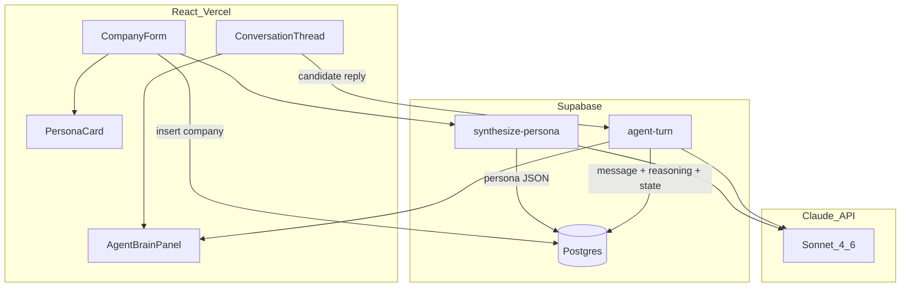

# PsVIEW Founding Engineer Take-Home — Full Implementation Plan

> **Live progress tracker** — update as phases complete. Quick status: [BUILD_PLAN.md](BUILD_PLAN.md)

| Phase | Status |
|-------|--------|
| 0 — Accounts & tooling | **Done** |
| 1 — Database schema | **Done** |
| 2 — `synthesize-persona` | **Done** |
| 3 — `agent-turn` | **Done** |
| 4 — React UI | Pending |
| 5 — Deploy | Pending |
| 6 — Polish | Pending |
| 7 — README + submit | Pending |
| 8 — Buffer | Pending |

---

# PsVIEW Founding Engineer Take-Home — Full Implementation Plan

## What they are actually testing

The brief has **three functional requirements** and **one meta-requirement** that matters more than the rest.

### Functional requirements (must ship all three)

| # | Requirement | What "pass" looks like |
|---|-------------|------------------------|
| 1 | **Company context form** | Capture who the company is, culture, hiring profiles, tone. They will test with a **real company** — not lorem ipsum. |
| 2 | **Self-configuring agent** | From that context alone, the agent derives its own personality, generates an outreach sequence, and runs the conversation. No hardcoded personas per company. |
| 3 | **Test/preview area** | Nothing sends for real. You see messages the agent would produce. You type simulated candidate replies and watch it react. |

### Meta-requirement (this is how you win)

They repeat the same idea four times: **"not prompt wrappers," "autonomous," "show where the intelligence is," "what makes your agent intelligent and not just an LLM call?"**

**Translation:** A chat UI with a good system prompt will **not** advance you. They want a **system** where you can point at concrete steps — perception, strategy choice, state update, self-correction — and see those steps change behavior across different company configs.

### Deliverables (graded mechanically)

1. **Live URL** — works in incognito, no setup required on their end
2. **GitHub repo** — clean, no secrets, real README
3. **Short README** with the one-liner answer to "intelligent vs LLM call"
4. **24 hours** from when you start (prep accounts/repo before starting the clock)

### What gets you to the next round

Founders are hiring a **founding engineer** who ships full-stack fast, has high agency, and thinks in agents — not features. Your submission signals:

- **Product sense:** polished, demo-ready on first click (seed PSVIEW as demo company)
- **Engineering judgment:** API keys server-side, structured outputs, handles edge cases (opening message, hostile reply)
- **Agent thinking:** visible loop + persistent state, not hidden in one prompt
- **Stack fit:** you chose React/TS + Supabase deliberately (you confirmed this path)
- **AI-native operator:** you used Cursor/Lovable with opinions, documented honestly in README

---

## Verdict on your attached plan ([readme.md](readme.md))

**The plan is very good — use it as your primary spec.** It correctly identifies:

- The winning axis: **legible intelligence** (Agent Brain panel)
- The right architecture: **Observe → Reason → Act → Update** with persistent `state`
- The right standout: **self-critique** (draft → critique → revise)
- The right stack signal: **React + Supabase Edge Functions + Vercel**
- The right traps to avoid: if/else scripts, hidden reasoning, client-side API keys, over-scoping

### Refinements to add (small, high impact)

1. **Use Claude structured outputs** — With your Claude API key, use `tool_choice` with a single tool schema (or Anthropic's JSON mode) instead of raw `JSON.parse` on free text. Add **Zod validation** server-side; retry once on schema failure. This prevents the #1 24h killer: broken JSON mid-demo.

2. **Model: Claude Sonnet 4.6** (not Opus) — Sonnet is fast enough for 2 calls/turn, strong at structured reasoning, and cheap enough to iterate. Reserve Opus only if Sonnet's strategy selection feels weak in testing.

3. **Pre-seed + "Run demo" button** — On live URL load, one click loads PSVIEW's real context (from their job posting / website) so graders don't have to fill a form to see intelligence.

4. **Opening-message path** — Explicitly test `candidate_reply = null`: observation fields empty/skipped, agent still produces opening + plan + state.

5. **Side-by-side compare** — Only if ahead of schedule at hour 18. Self-critique + Brain panel are higher ROI.

6. **Skip Lovable if it slows you** — Lovable is great for UI shell in hour 1, but if you're strong in Cursor, scaffold the React app with `create-vite` + Tailwind in Cursor and skip the Lovable export friction. Document whichever path you took.

---

## Recommended model choice

**Primary: `claude-sonnet-4-6`**

| Model | Use in this project | Why |
|-------|---------------------|-----|
| **Claude Sonnet 4.6** | All agent steps (persona synthesis, turn loop, self-critique) | Best balance of reasoning quality, JSON reliability, latency, and cost for a 24h build. Aligns with PsVIEW's Claude usage. |
| Claude Opus 4.x | Skip unless Sonnet fails strategy selection in testing | Too slow/expensive for 2 LLM calls per turn under time pressure |
| GPT-4.1 | Skip (you have Claude) | No benefit to integrating a second provider |
| Gemini | Skip | Same — one model, routed per step later (mention in README) |

**Per-step routing (README talking point, not implementation):** "Persona synthesis could use a heavier model; critique could use a lighter one — the loop is model-agnostic."

---

## Architecture (validated)



### Data model

Use the exact SQL from [readme.md](readme.md) sections 3–4:

- `companies` — raw form context
- `agent_configs` — **self-generated** persona JSON (proves "configures itself")
- `conversations` — intent + persistent `state` (stage, interest_score, objections, candidate_model)
- `messages` — thread + `reasoning` JSON on agent turns

### Two Edge Functions (server-side LLM only)

**`synthesize-persona`**
- Input: `company_id`
- Output: structured persona → stored in `agent_configs`
- Proves: personality is derived, not hardcoded

**`agent-turn`**
- Input: `conversation_id`, optional `candidate_reply`
- Flow:
  1. Store candidate message if present
  2. **Call 1:** Observe + Reason + Draft (single structured response)
  3. **Call 2:** Self-critique → revised message
  4. Persist message with `reasoning: { observation, plan, critique }` + update `conversations.state`
- Return: message, reasoning trace, new state to frontend

**The README one-liner (write this first, before coding):**

> Every message is the output of an explicit Observe → Reason → Act → Update loop: the agent turns each reply into structured signals, selects a strategy against its goal and self-authored persona, critiques its own draft, and updates a persistent candidate model before writing. The text is the last step, not the system.

---

## Frontend — three zones

### Zone A: Company form
Fields: `name`, `one_liner`, `culture`, `profiles_hired`, `tone_preference`, `selling_points`

On submit: insert → call `synthesize-persona` → show persona card.

Include **"Load PSVIEW demo"** that pre-fills from their public positioning (staffing AI agents, US + France, autonomous sourcing/engagement, Founders Inc SF).

### Zone B: Persona card
Render self-generated persona: agent name, archetype, tone dials (0–10 bars), voice rules, company hooks. This instantly proves requirements 2a and "knows the company."

### Zone C: Test area (the money shot)
**Left:** conversation thread + "Simulate candidate reply" input + clear "Nothing is sent" banner.

**Right — Agent Brain panel** (non-negotiable):
1. **Observation** — sentiment chip, interest delta, objections, questions
2. **Plan** — strategy chip (`open|build_rapport|pitch_value|handle_objection|answer_question|propose_call|nudge|disqualify`) + one-line rationale
3. **Self-critique** — critique text + draft vs revised toggle
4. **State strip** — interest gauge (0–100), stage, objections (resolved struck through)

When agent chooses `disqualify` or `propose_call` autonomously, surface it prominently — that's visible agency.

---

## AI tools — what to use, for what, how

They screen for **AI-native fluency**. Use tools deliberately; document tradeoffs in README.

### Cursor (primary driver — 70% of build time)
**Use for:**
- Supabase Edge Function scaffolding (`synthesize-persona`, `agent-turn`)
- Prompt engineering with explicit JSON schemas pasted as spec
- Zod validation, CORS, error handling
- React wiring (form → API → Brain panel)
- Debugging structured output failures

**How:** Plan-first prompting. Paste the data model + function contracts from [readme.md](readme.md) as context. Build and test **one function at a time with curl** before touching UI. Never vibe-code the whole app in one shot.

### Lovable (optional — UI shell only, ~1 hour max)
**Use for:** rapid layout of form + split-pane thread/Brain panel if you're not fast in React.

**Skip if:** Cursor + Tailwind component library gets you there faster. Export/refine in Cursor; don't let Lovable own agent logic.

### Claude (the agent's brain, not your codegen)
**Use for:** runtime LLM calls inside Edge Functions only.

**Do not:** paste your API key into frontend or commit it.

### Supabase CLI + Dashboard
**Use for:** schema migration, `supabase functions deploy`, secrets (`LLM_API_KEY`, `SUPABASE_SERVICE_ROLE_KEY`).

### Vercel
**Use for:** frontend deploy = your live URL. Env vars: `VITE_SUPABASE_URL`, `VITE_SUPABASE_ANON_KEY`.

### Optional: Loom (60 sec)
Not required, but a tight demo video walking through Brain panel + hostile-reply disqualify is a strong surprise. Only if finished early.

---

## 24-hour execution schedule (overview)

Prep **before** starting the clock: Supabase project, Vercel account, GitHub repo, Claude API key, this plan.

| Hours | Focus | Exit criteria |
|-------|-------|---------------|
| 0–1 | Write README one-liner + finalize schemas. Create repo. Run SQL in Supabase. | Schema live, one-liner written |
| 1–4 | Build + curl-test `synthesize-persona` with 2 different companies | Two visibly different persona JSONs |
| 4–9 | Build + curl-test `agent-turn` (opening, positive, skeptical, hostile replies) | Full reasoning trace in JSON every turn |
| 9–14 | React UI: form → persona → thread → Brain panel | End-to-end on localhost |
| 14–18 | Deploy Vercel + Edge Functions. Seed PSVIEW demo. | Live URL works incognito |
| 18–21 | Self-critique UI polish + interest gauge animation | Demo feels product-ready |
| 21–23 | README final, clean commits, pre-flight checklist | All deliverables complete |
| 23–24 | Buffer — retest opening message + hostile reply on live URL | Submit |

**If behind:** cut side-by-side compare and Loom. **Never cut:** Brain panel, self-critique, server-side keys.

---

## Detailed implementation plan — each phase

### Phase 0 (before clock): Accounts and tooling

Do this **before** the 24h timer starts so hour 0 is pure building.

**Accounts to create:**
- [supabase.com](https://supabase.com) — new project, pick region closest to you (US West if simulating SF latency)
- [vercel.com](https://vercel.com) — connect to GitHub
- [console.anthropic.com](https://console.anthropic.com) — API key with billing enabled
- GitHub — empty repo `psview-agent` (private is fine; make public before submit if you prefer)

**Local tooling to install:**
```bash
npm install -g supabase          # Supabase CLI
# Node 18+ required
```

**Link Supabase locally (optional but speeds iteration):**
```bash
supabase login
supabase init                    # in repo root
supabase link --project-ref <your-project-ref>
```

**Secrets you'll need later (write down, never commit):**
- `SUPABASE_URL` — Project Settings → API
- `SUPABASE_ANON_KEY` — frontend only
- `SUPABASE_SERVICE_ROLE_KEY` — Edge Functions only
- `LLM_API_KEY` — Anthropic API key

---

### Phase 1 — Hours 0–1: Foundation (schema, repo, one-liner)

**Goal:** A working database and repo skeleton. No LLM calls yet.

#### Step 1.1 — Write the README one-liner first (15 min)

Create `README.md` at repo root with this block at the top (fill URLs later):

```markdown
# PsVIEW Agent — autonomous candidate engagement demo

**Live:** TBD   **Repo:** TBD

## What makes it intelligent, not just an LLM call
Every message is the output of an explicit Observe → Reason → Act → Update loop:
the agent turns each reply into structured signals, selects a strategy against its
goal and self-authored persona, critiques its own draft, and updates a persistent
candidate model before writing. The text is the last step, not the system.
```

Writing this first forces architectural clarity before you code.

#### Step 1.2 — Initialize repo structure (15 min)

```bash
mkdir psview-agent && cd psview-agent
git init
npm create vite@latest frontend -- --template react-ts
cd frontend && npm install && npm install @supabase/supabase-js
cd .. && supabase init
```

Target structure:
```
psview-agent/
├── README.md
├── .gitignore              # node_modules, .env, .env.local
├── frontend/
│   ├── .env.local            # VITE_SUPABASE_URL, VITE_SUPABASE_ANON_KEY (gitignored)
│   └── src/
└── supabase/
    ├── migrations/
    │   └── 001_schema.sql
    └── functions/
        ├── _shared/          # shared LLM + CORS helpers
        ├── synthesize-persona/
        └── agent-turn/
```

#### Step 1.3 — Run database schema (20 min)

Create `supabase/migrations/001_schema.sql` with the four tables from [readme.md](readme.md) section 3 (`companies`, `agent_configs`, `conversations`, `messages`).

Apply via Supabase Dashboard → SQL Editor (paste + Run) **or**:
```bash
supabase db push
```

**Verify in Dashboard → Table Editor:** all 4 tables exist, `conversations.state` has default JSON.

#### Step 1.4 — Seed two test companies manually (10 min)

Insert via SQL Editor for later curl tests:

```sql
-- Company A: PSVIEW (formal startup)
insert into companies (name, one_liner, culture, profiles_hired, tone_preference, selling_points)
values (
  'PSVIEW',
  'AI agents that source, engage, and place candidates end-to-end',
  'Small elite team, high agency, founders who ship. US + France. Founders Inc SF.',
  'Founding engineers: full-stack TS/React, Supabase, LLM orchestration. High agency, client-facing.',
  'warm but direct',
  '6-figure ARR, 20+ paying clients, real revenue. Work directly impacts hiring across US and France.'
);

-- Company B: contrast (formal enterprise)
insert into companies (name, one_liner, culture, profiles_hired, tone_preference, selling_points)
values (
  'Meridian Capital',
  'Global investment bank, 150 years of market leadership',
  'Formal, precise, meritocratic. Deep expertise valued over hustle culture.',
  'VP-level quantitative researchers with PhD in math/physics, 8+ years sell-side experience.',
  'formal and measured',
  'Top-tier compensation, global mobility, access to flagship trading desk.'
);
```

Copy both `id` UUIDs — you'll use them in Phase 2 curl tests.

**Exit criteria for Phase 1:**
- [ ] Repo initialized, first commit: `chore: init repo, schema, readme one-liner`
- [ ] 4 tables live in Supabase
- [ ] 2 seed companies inserted with known UUIDs

---

### Phase 2 — Hours 1–4: `synthesize-persona` Edge Function

**Goal:** Given a `company_id`, agent derives and stores a structured persona. Test with curl before any UI.

#### Step 2.1 — Shared LLM helper (30 min)

Create `supabase/functions/_shared/llm.ts`:

**What it does:**
- Calls Claude Sonnet 4.6 with a system prompt + user message
- Uses **tool use** for structured output (more reliable than free-text JSON)
- Validates response with Zod
- Retries once on validation failure

**Cursor prompt to paste:**
> Create `supabase/functions/_shared/llm.ts` for Deno/Supabase Edge Functions. Export `callClaudeJSON<T>(system, user, schema: ZodSchema<T>): Promise<T>`. Use Anthropic Messages API with model `claude-sonnet-4-6`, tool_choice forcing a single tool named `output` whose input_schema matches the Zod schema converted to JSON Schema. On Zod parse failure, retry once with user message "Your output failed validation: {errors}. Return corrected output." Include `supabase/functions/_shared/cors.ts` exporting corsHeaders for OPTIONS + JSON responses.

**Zod schema for persona** (`supabase/functions/_shared/schemas.ts`):
```ts
export const PersonaSchema = z.object({
  agent_name: z.string(),
  archetype: z.string(),
  tone_dials: z.object({
    formality: z.number().min(0).max(10),
    warmth: z.number().min(0).max(10),
    directness: z.number().min(0).max(10),
    humor: z.number().min(0).max(10),
    enthusiasm: z.number().min(0).max(10),
  }),
  voice_rules: z.array(z.string()).min(3).max(5),
  company_hooks: z.array(z.string()).min(2),
  target_profile_understanding: z.string(),
  goal_framing: z.string(),
  guardrails: z.array(z.string()).min(2),
});
```

#### Step 2.2 — Build `synthesize-persona` function (60 min)

Create `supabase/functions/synthesize-persona/index.ts`:

**Request:** `POST { "company_id": "uuid" }`

**Logic:**
1. Handle CORS preflight (`OPTIONS`)
2. Load company row from `companies` by id; 404 if missing
3. Build system prompt (from [readme.md](readme.md) section 4a) — persona architect, no outreach
4. Build user message interpolating all company fields
5. Call `callClaudeJSON(system, user, PersonaSchema)`
6. Insert into `agent_configs`: `{ company_id, persona: result }`
7. Return `{ agent_config_id, persona }`

**Deploy and set secrets:**
```bash
supabase secrets set LLM_API_KEY=sk-ant-...
supabase secrets set SUPABASE_SERVICE_ROLE_KEY=eyJ...   # only if not auto-injected
supabase functions deploy synthesize-persona
```

Note: `SUPABASE_URL` and `SUPABASE_SERVICE_ROLE_KEY` are often auto-available in Edge Functions — check Supabase docs for your project.

#### Step 2.3 — curl test both companies (30 min)

```bash
# Get your function URL from: supabase functions list
# Or: https://<project-ref>.supabase.co/functions/v1/synthesize-persona

curl -X POST 'https://<ref>.supabase.co/functions/v1/synthesize-persona' \
  -H 'Authorization: Bearer <SUPABASE_ANON_KEY>' \
  -H 'Content-Type: application/json' \
  -d '{"company_id": "<PSVIEW_UUID>"}'
```

**What to verify in the JSON response:**

| Field | PSVIEW should look like | Meridian Capital should look like |
|-------|------------------------|-----------------------------------|
| `agent_name` | Casual first name | More formal name |
| `archetype` | "warm insider" / "sharp operator" | "measured expert" / "institutional guide" |
| `tone_dials.warmth` | Higher (7–9) | Lower (3–5) |
| `tone_dials.formality` | Mid (5–7) | High (8–10) |
| `company_hooks` | Mentions AI agents, ARR, US+France | Mentions compensation, PhD, trading desk |

If both personas look generic or identical, **fix the prompt before moving on** — this is a graded requirement.

**Exit criteria for Phase 2:**
- [ ] `synthesize-persona` deployed
- [ ] curl returns valid persona JSON for PSVIEW
- [ ] curl returns visibly different persona for Meridian Capital
- [ ] Both stored in `agent_configs` table

---

### Phase 3 — Hours 4–9: `agent-turn` Edge Function

**Goal:** Full Observe → Reason → Act → Update + self-critique loop. Four curl scenarios must pass.

#### Step 3.1 — Define turn + critique schemas (20 min)

In `supabase/functions/_shared/schemas.ts`:

```ts
export const TurnSchema = z.object({
  observation: z.object({
    sentiment: z.enum(["positive", "neutral", "negative", "hostile"]),
    interest_signal: z.number().min(-20).max(20),
    objections: z.array(z.string()),
    questions: z.array(z.string()),
    stage_signal: z.string(),
  }).nullable(),  // null on opening message
  plan: z.object({
    chosen_strategy: z.enum([
      "open", "build_rapport", "pitch_value", "handle_objection",
      "answer_question", "propose_call", "nudge", "disqualify"
    ]),
    rationale: z.string(),
  }),
  message: z.string().min(1),           // draft before critique
  state_update: z.object({
    stage: z.string(),
    interest_score: z.number().min(0).max(100),
    objections: z.array(z.string()),
    candidate_model: z.record(z.unknown()),
  }),
});

export const CritiqueSchema = z.object({
  critique: z.string(),
  revised_message: z.string(),
});
```

#### Step 3.2 — Build `agent-turn` function (90 min)

Create `supabase/functions/agent-turn/index.ts`:

**Request:** `POST { "conversation_id": "uuid", "candidate_reply": "string or omit" }`

**Logic (in order):**

1. **Load context** — join query:
   ```ts
   supabase.from("conversations")
     .select("*, agent_configs(persona, companies(*))")
     .eq("id", conversation_id).single()
   ```
2. **Load message history** — ordered by `created_at`
3. **If `candidate_reply` provided** — insert into `messages` as `role: "candidate"`
4. **Call 1 — Turn loop** — system prompt from [readme.md](readme.md) 4b:
   - Interpolate: `agent_name`, `company_name`, `persona`, `intent`, `state`, `messages`, `candidate_reply || "NONE — opening message"`
   - For opening: tell model observation can be null / skipped
   - Parse with `TurnSchema`
5. **Call 2 — Self-critique** — pass draft `turn.message`, persona, goal:
   - Parse with `CritiqueSchema`
6. **Persist agent message:**
   ```ts
   reasoning: {
     observation: turn.observation,
     plan: turn.plan,
     draft_message: turn.message,      // store draft for UI toggle
     critique: crit.critique,
   }
   content: crit.revised_message
   ```
7. **Update conversation state:** `state = turn.state_update`
8. **Return:** `{ message, reasoning, state, draft_message: turn.message }`

**Deploy:**
```bash
supabase functions deploy agent-turn
```

#### Step 3.3 — Create test conversation via SQL (10 min)

```sql
-- Use agent_config_id from Phase 2 PSVIEW persona
insert into conversations (agent_config_id, candidate_name, candidate_profile, intent)
values (
  '<psview_agent_config_id>',
  'Alex Chen',
  'Senior full-stack engineer, 5 years React/Node, currently at a Series B startup. Passive but curious about founding roles.',
  'Book a 15-minute intro call with a PSVIEW founder'
)
returning id;
```

Save `conversation_id` for curl tests.

#### Step 3.4 — Four curl test scenarios (60 min)

**Test 1 — Opening message (no candidate_reply):**
```bash
curl -X POST '.../agent-turn' \
  -H 'Authorization: Bearer <ANON_KEY>' \
  -H 'Content-Type: application/json' \
  -d '{"conversation_id": "<id>"}'
```
Verify: `observation` is null or empty; `plan.chosen_strategy` is `"open"`; message mentions PSVIEW-specific hooks (AI agents, founding engineer, etc.); `state.interest_score` is a number.

**Test 2 — Positive reply:**
```bash
-d '{"conversation_id": "<id>", "candidate_reply": "This sounds interesting! What does the team look like and what''s the comp range?"}'
```
Verify: `observation.sentiment` = positive; strategy is `answer_question` or `pitch_value`; interest_score increased; message answers in persona.

**Test 3 — Skeptical reply:**
```bash
-d '{"conversation_id": "<id>", "candidate_reply": "I get a lot of these messages. Why should I care about another AI recruiting startup?"}'
```
Verify: strategy is `handle_objection` or `pitch_value`; uses real `company_hooks` in rationale and message; interest may dip but agent doesn't give up immediately.

**Test 4 — Hostile reply (new conversation recommended):**
```bash
# Create fresh conversation, generate opening first, then:
-d '{"conversation_id": "<new_id>", "candidate_reply": "Stop spamming me. Take me off your list."}'
```
Verify: `observation.sentiment` = hostile; strategy = `disqualify`; message is short, graceful, no pushy CTA; interest_score drops.

**Common failures and fixes:**

| Failure | Fix |
|---------|-----|
| JSON parse error | Switch to tool_use; add Zod retry |
| Generic copy ("exciting opportunity") | Strengthen "MUST use company_hooks" in prompt; show hooks in user message |
| Agent never disqualifies | Add explicit rule: "hostile = disqualify" in prompt |
| Opening crashes on null observation | Make `observation` nullable in Zod; handle null in persist |
| Function timeout (150s default) | Reduce `max_tokens` to 1200; keep 2 calls not 4 |

**Exit criteria for Phase 3:**
- [ ] All 4 curl scenarios return full `reasoning` object
- [ ] `draft_message` included in response for UI toggle
- [ ] `messages` and `conversations.state` updated in DB after each call
- [ ] PSVIEW-specific language in messages, not generic recruiter copy

---

### Phase 4 — Hours 9–14: React frontend

**Goal:** Wire form → persona → conversation → Brain panel. Works end-to-end on localhost.

#### Step 4.1 — Scaffold UI shell (45 min)

In `frontend/`:
```bash
npm install -D tailwindcss @tailwindcss/vite
```

**Cursor prompt:**
> Build a single-page React + TypeScript + Tailwind app with three sections: (1) CompanyForm, (2) PersonaCard, (3) split-pane TestArea with ConversationThread left and AgentBrainPanel right. Dark monospace styling on Brain panel. Use Supabase client from `src/lib/supabase.ts`. No API keys in frontend.

**App state (use React `useState` or a simple context — no Redux needed):**
```ts
type AppState = {
  companyId: string | null;
  agentConfigId: string | null;
  persona: Persona | null;
  conversationId: string | null;
  messages: Message[];
  latestReasoning: Reasoning | null;
  conversationState: ConversationState | null;
  loading: boolean;
  error: string | null;
};
```

#### Step 4.2 — CompanyForm component (45 min)

**Fields:** name, one_liner, culture, profiles_hired, tone_preference, selling_points (all text inputs/textareas)

**On submit:**
1. `supabase.from("companies").insert({ ...fields, raw_context: fields }).select().single()`
2. `fetch(`${SUPABASE_URL}/functions/v1/synthesize-persona`, { method: "POST", headers: { Authorization: `Bearer ${anonKey}` }, body: JSON.stringify({ company_id }) })`
3. Set `persona` + `agentConfigId` in state
4. Scroll to PersonaCard

**"Load PSVIEW demo" button** — pre-fills:
```ts
const PSVIEW_DEMO = {
  name: "PSVIEW",
  one_liner: "Autonomous AI agents that source, engage, and place candidates in 48 hours",
  culture: "Elite small team, high agency, founders who ship. US + France. Based at Founders Inc, San Francisco.",
  profiles_hired: "Founding engineers: React/TypeScript, Supabase, LLM orchestration. Client-facing, high agency.",
  tone_preference: "warm but direct",
  selling_points: "6-figure ARR, 20+ paying clients, real revenue. Replace 2-week recruiter workflows with 48-hour agent pipelines.",
};
```

#### Step 4.3 — PersonaCard component (30 min)

Render from `persona` JSON:
- Header: `{agent_name}` — `{archetype}`
- 5 tone dials: horizontal progress bars (0–10), labels formality/warmth/directness/humor/enthusiasm
- Lists: voice_rules, company_hooks, guardrails
- **"Start conversation" section:**
  - Inputs: candidate_name, candidate_profile, intent (default: "Book a 15-minute intro call")
  - Button: "Create conversation" → insert into `conversations` table

#### Step 4.4 — ConversationThread component (45 min)

**UI elements:**
- Banner: "Preview only — nothing is sent"
- Message bubbles: agent (left/blue), candidate (right/gray)
- On mount or "Generate opening" button → call `agent-turn` with only `conversation_id`
- Textarea + "Send as candidate" button → call `agent-turn` with `candidate_reply`
- Loading spinner during LLM calls (can take 5–15 sec)
- Append returned message to thread; pass `reasoning` + `state` up to parent

**Fetch pattern:**
```ts
async function runAgentTurn(conversationId: string, candidateReply?: string) {
  setLoading(true);
  const res = await fetch(`${import.meta.env.VITE_SUPABASE_URL}/functions/v1/agent-turn`, {
    method: "POST",
    headers: {
      "Content-Type": "application/json",
      Authorization: `Bearer ${import.meta.env.VITE_SUPABASE_ANON_KEY}`,
    },
    body: JSON.stringify({ conversation_id: conversationId, candidate_reply: candidateReply }),
  });
  const data = await res.json();
  // refresh messages from DB or append locally
  setLatestReasoning(data.reasoning);
  setConversationState(data.state);
  setLoading(false);
}
```

#### Step 4.5 — AgentBrainPanel component (90 min) — THE MONEY SHOT

This is the most important UI. Build it even if everything else is plain.

**Layout:** right column, monospace font, subtle border, 3 stacked cards + state strip.

**Card 1 — Observation** (hide or show "Opening message — no observation yet" if null):
- Sentiment chip with color: positive=green, neutral=gray, negative=orange, hostile=red
- Interest signal: `+12` or `-8` with arrow
- Objections: bullet list
- Questions: bullet list
- Stage signal: italic text

**Card 2 — Plan:**
- Strategy chip (color-coded by type)
- Rationale: one sentence, quoted

**Card 3 — Self-critique:**
- Critique paragraph
- Toggle: "Show draft" / "Show revised" — switches between `draft_message` and final `message`

**State strip (persistent at bottom):**
- Interest gauge: SVG arc or horizontal bar 0–100, animate on change (`transition-all duration-500`)
- Stage badge: `opening` → `rapport` → `pitching` → etc.
- Objections tracker: list with strikethrough for resolved

**Highlight autonomous decisions:**
- If `plan.chosen_strategy === "disqualify"` → red banner: "Agent decided to end outreach"
- If `plan.chosen_strategy === "propose_call"` → green banner: "Agent is moving to schedule"

#### Step 4.6 — Wire end-to-end on localhost (30 min)

```bash
cd frontend
# Create .env.local:
# VITE_SUPABASE_URL=https://xxx.supabase.co
# VITE_SUPABASE_ANON_KEY=eyJ...
npm run dev
```

**Manual test flow:**
1. Click "Load PSVIEW demo" → Submit → see persona card
2. Fill candidate info → Create conversation
3. Click "Generate opening" → see message + Brain panel populated
4. Type skeptical reply → Send → see observation, plan, critique update
5. Type hostile reply → see disqualify strategy

**Exit criteria for Phase 4:**
- [ ] Full flow works on `localhost:5173`
- [ ] Brain panel shows all 3 cards on every agent turn
- [ ] Draft/revised toggle works
- [ ] Interest gauge updates between turns
- [ ] Loading states prevent double-submit

---

### Phase 5 — Hours 14–18: Deploy + seed demo

**Goal:** Live URL works in incognito with zero setup for the grader.

#### Step 5.1 — Deploy Edge Functions (if not already) (15 min)

```bash
supabase functions deploy synthesize-persona
supabase functions deploy agent-turn
supabase secrets set LLM_API_KEY=sk-ant-...
```

Verify functions work against **production** URL (not local).

#### Step 5.2 — Deploy frontend to Vercel (30 min)

```bash
git add . && git commit -m "feat: agent loop + frontend"
git push origin main
```

Vercel dashboard → Import Git repo → Root directory: `frontend`

**Environment variables in Vercel:**
- `VITE_SUPABASE_URL`
- `VITE_SUPABASE_ANON_KEY`

Deploy. Copy production URL.

#### Step 5.3 — Seed production demo data (30 min)

Option A — **SQL seed in production Supabase** (recommended):
```sql
-- Insert PSVIEW company, run synthesize-persona via curl against prod,
-- insert a pre-built conversation with 1 opening message already generated
```

Option B — **"Run demo" button in UI** that:
1. Inserts PSVIEW company (or uses hardcoded seed UUIDs from prod DB)
2. Calls synthesize-persona
3. Creates conversation
4. Auto-generates opening message
5. Lands user directly on TestArea with Brain panel visible

Option B is better UX — grader clicks one button and sees intelligence immediately.

#### Step 5.4 — Incognito smoke test (30 min)

Open live URL in incognito:
- [ ] No console errors
- [ ] Demo button works
- [ ] Opening message generates
- [ ] Candidate reply works
- [ ] Brain panel populates
- [ ] Network tab shows NO `sk-ant-` or service role key in any request

**Exit criteria for Phase 5:**
- [ ] Live URL in README
- [ ] One-click demo works for a stranger
- [ ] All API keys server-side only

---

### Phase 6 — Hours 18–21: Polish

**Goal:** Make it feel like a product, not a homework assignment.

#### Step 6.1 — Self-critique UI polish (45 min)
- Animate draft → revised toggle (crossfade or side-by-side diff)
- If draft === revised, show badge: "No revision needed"
- Show word count delta if revised is shorter/longer

#### Step 6.2 — Interest gauge animation (30 min)
- Animate bar/arc when `interest_score` changes
- Color gradient: red (0–30) → yellow (31–60) → green (61–100)
- Show delta chip: "+15 from last turn"

#### Step 6.3 — Visual design pass (45 min)
- One accent color (pick something confident — not default Tailwind blue)
- Generous whitespace, clear typography hierarchy
- Empty states: "Generate an opening message to see the agent think"
- Error states: friendly message if LLM times out, with retry button
- Mobile: stack Brain panel below thread (basic responsive)

#### Step 6.4 — Edge case hardening (30 min)
- Disable send button while loading
- Handle 500 from Edge Function gracefully
- Prevent generating opening twice (check if messages exist)
- Trim whitespace on candidate reply input

#### Step 6.5 — Optional: side-by-side compare (only if ahead) (60 min)
- Route `/compare` or a tab
- Select two `agent_config_id`s
- One candidate message input
- Call `agent-turn` twice in parallel (two conversation IDs)
- Show both replies + both Brain panels side by side

**Exit criteria for Phase 6:**
- [ ] App looks intentional, not scaffolded
- [ ] Autonomous disqualify/propose_call moments are visually highlighted
- [ ] No rough edges on happy path

---

### Phase 7 — Hours 21–23: README + repo hygiene

**Goal:** Deliverables complete and submission-ready.

#### Step 7.1 — Finalize README (45 min)

Use template from [readme.md](readme.md) section 9. Must include:

```markdown
# [Your Agent Name] — autonomous candidate engagement agent

**Live:** https://your-app.vercel.app
**Repo:** https://github.com/you/psview-agent

## What it is
(3 sentences)

## What makes it intelligent, not just an LLM call
(the one-liner)

## Architecture
(mermaid or ASCII diagram)

## Where the intelligence lives
(bullet list pointing at persona synthesis, observation, strategy, critique, state)

## Choices
- React/TS + Supabase Edge Functions + Vercel (matched PSVIEW stack)
- Claude Sonnet 4.6, structured outputs via tool use + Zod
- Reasoning surfaced in UI by design

## Tools used (and opinions)
- Cursor: [what you used it for, one limitation you hit]
- Supabase: [what, one opinion]
- Vercel: [what]

## Run it
Click "Run PSVIEW demo" on the live URL. Or locally: `cd frontend && npm i && npm run dev`
```

#### Step 7.2 — Clean git history (30 min)

Aim for 5–8 meaningful commits (not one giant dump):
```
chore: init repo, schema, readme one-liner
feat: synthesize-persona edge function
feat: agent-turn loop with self-critique
feat: company form + persona card
feat: conversation thread + agent brain panel
feat: deploy config + PSVIEW demo seed
polish: brain panel UX + interest gauge
docs: final readme with live URL
```

#### Step 7.3 — Pre-flight checklist (45 min)

Run every item:

- [ ] Live URL in incognito — demo loads, one click to see agent think
- [ ] Opening message with no candidate reply
- [ ] Positive reply → interest goes up, agent answers questions
- [ ] Skeptical reply → handles objection with PSVIEW hooks
- [ ] Hostile reply → agent disqualifies gracefully
- [ ] Two companies → different personas (test Meridian Capital vs PSVIEW)
- [ ] No API key in client bundle (search built JS for `sk-ant`)
- [ ] README has live URL + repo URL + one-liner at top
- [ ] `.env` files gitignored, no secrets in repo
- [ ] GitHub repo is accessible (public or invite them)

#### Step 7.4 — Optional 60-second Loom (30 min)

Script from plan section "60-second demo script". Upload link in README or email.

**Exit criteria for Phase 7:**
- [ ] All 3 deliverables complete: URL, repo, README
- [ ] Pre-flight checklist 100% green

---

### Phase 8 — Hours 23–24: Buffer + submit

**Goal:** Submit with confidence, not panic.

#### Step 8.1 — Fresh-device test (20 min)
- Open live URL on phone or friend's laptop
- Run full demo flow without explaining anything
- If anything confuses you, it will confuse them

#### Step 8.2 — Reply email (10 min)

```
Subject: PSVIEW Founding Engineer — Technical Test Submission

Hi [Name],

Here's my submission:

Live demo: https://...
GitHub: https://...

The README has a one-line answer to what makes the agent intelligent vs an LLM call.
The fastest path: click "Run PSVIEW demo" and send a skeptical reply — the Brain panel
shows the full Observe → Reason → Critique → Update loop.

Happy to walk through it on a call.

[Your name]
```

#### Step 8.3 — Keep buffer for fixes
- If something breaks in fresh-device test, fix and redeploy
- Do NOT add new features in the buffer — only bug fixes

---

### Cursor prompt cheat sheet (copy-paste per phase)

**Phase 2 — synthesize-persona:**
> I have a Supabase Edge Function project. Create `synthesize-persona/index.ts` and `_shared/llm.ts`. The function takes `{ company_id }`, loads the company row, calls Claude Sonnet 4.6 with tool_use to return a PersonaSchema (Zod), stores in `agent_configs`, returns `{ agent_config_id, persona }`. Include CORS. Use the persona system prompt from my readme. Deno runtime.

**Phase 3 — agent-turn:**
> Create `agent-turn/index.ts`. Input: `{ conversation_id, candidate_reply? }`. Load conversation with joins to agent_configs and companies. If candidate_reply, insert candidate message. Call Claude twice: (1) TurnSchema with observe/reason/draft/update, (2) CritiqueSchema. Store agent message with reasoning including draft_message. Update conversation state. Return full trace. Handle opening message when candidate_reply is absent.

**Phase 4 — Brain panel:**
> Create `AgentBrainPanel.tsx`. Props: `reasoning`, `state`, `draftMessage`, `finalMessage`. Show Observation card (sentiment chip, interest delta, objections, questions), Plan card (strategy chip + rationale), Critique card (critique text + draft/revised toggle). Bottom state strip: animated interest gauge 0-100, stage badge, objections list. Highlight disqualify and propose_call strategies. Monospace dark panel styling.

---

## How to stand out (priority order)

1. **Agent Brain panel** — makes intelligence visible; answers their repeated question on screen
2. **Self-critique with draft → revised toggle** — clearest proof you're not a prompt wrapper
3. **PSVIEW pre-seeded demo** — shows you researched them; graders see quality in 10 seconds
4. **Autonomous disqualify on hostile reply** — shows judgment, not script
5. **Two-company personality contrast** — fill form for a formal enterprise vs a casual startup; different tone dials and copy
6. *(If time)* Side-by-side compare view — same candidate message, two agents, two replies

**Do not build:** real email/LinkedIn sending, auth, multi-tenant admin, three-model routing, RAG over documents. Depth beats breadth.

---

## Pre-flight checklist (submit only when all pass)

- [ ] Live URL loads in incognito — demo works on first click
- [ ] Opening message works with no candidate reply
- [ ] Positive, skeptical, and hostile replies all behave sensibly
- [ ] Two different companies → visibly different personas and messages
- [ ] No API key in client bundle (check Network tab / built JS)
- [ ] README has live URL, repo URL, one-liner near top
- [ ] Repo clean: no secrets, sensible commit history

---

## 60-second demo script (for Loom or mental rehearsal)

1. "Here's PSVIEW's context" (pre-seeded)
2. "The agent wrote this persona for itself — tone dials, hooks from real context"
3. "Opening message — generated from persona + goal, no script"
4. "Skeptical candidate reply" → point at Brain: observation, strategy, critique, interest score moved
5. "Hostile reply" → agent disqualifies gracefully on its own
6. "That loop is why this isn't a prompt wrapper"

---

## Repo structure (suggested)

```
/
├── README.md              # deliverable #3
├── frontend/              # Vite + React + TS (or /app if monorepo)
│   └── src/
│       ├── components/    # Form, PersonaCard, Thread, AgentBrain
│       └── lib/supabase.ts
└── supabase/
    ├── migrations/        # schema SQL
    └── functions/
        ├── synthesize-persona/
        └── agent-turn/
```

---

## Bottom line

Your [readme.md](readme.md) plan is **the right plan**. Execute it with Claude Sonnet 4.6, structured outputs + Zod validation, curl-test the agent before UI, and spend polish budget on the **Agent Brain panel**. That panel is the project — everything else exists to feed it.
