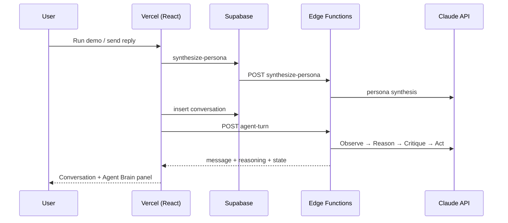

# PSVIEW Agent — autonomous candidate engagement agent

**Live:** https://psview-agent-demo-two.vercel.app  
**Repo:** https://github.com/harshitasayala10/psview-agent

## What it is

An autonomous recruiting agent that configures itself from company context, then engages a simulated candidate through a multi-step reasoning loop. Feed it a company profile (or click **Run demo**), and it synthesizes a bespoke outreach persona, generates opening messages, and adapts strategy turn-by-turn based on candidate replies. Every response is preview-only — nothing is sent externally.

## What makes it intelligent, not just an LLM call

Every message is the output of an explicit Observe → Reason → Act → Update loop: the agent turns each reply into structured signals, selects a strategy against its goal and self-authored persona, critiques its own draft, and updates a persistent candidate model before writing. The text is the last step, not the system.

## Architecture



## Where the intelligence lives

- **Persona synthesis** (`synthesize-persona`) — LLM reads company context and authors agent name, tone, hooks, and disqualification rules; reuses latest config per company unless `force: true`
- **Observation** — structured extraction of sentiment, objections, questions, and interest signals from each candidate reply
- **Strategy selection** — chooses from `open`, `pitch_value`, `handle_objection`, `propose_call`, `disqualify`, etc. based on persona goals and conversation state
- **Self-critique** — drafts a message, critiques it against persona constraints, revises if needed (surfaced in the Brain panel)
- **Persistent state** — `interest_score`, `stage`, and message history stored in Postgres and updated every turn

## Choices

- **React/TS + Supabase Edge Functions + Vercel** — matched PSVIEW stack; keeps LLM keys server-side
- **Claude Sonnet 4.6** — structured outputs via tool use; reasoning quality vs. latency trade-off accepted for demo
- **Reasoning surfaced in UI by design** — the Brain panel is a first-class feature, not a debug log

## Tools used (and opinions)

- **Cursor** — scaffolded UI components, edge function boilerplate, and deploy config; hit auto-review blocks on `gh repo create` and first Vercel deploy (needed manual approval)
- **Supabase** — Postgres + Edge Functions in one place; anon key + RLS is clean for a demo, secrets stay in function env
- **Vercel** — zero-config Vite deploy; `frontend/` root directory + SPA rewrites just work

## Run it

**Live (recommended):** Open the URL → click **Run demo** → try quick-reply chips (skeptical or hostile).

**Locally:**

```bash
cd frontend && npm install && npm run dev
```

Ensure `frontend/.env.local` has `VITE_SUPABASE_URL` and `VITE_SUPABASE_ANON_KEY`.

## Stack

- **Frontend:** React + TypeScript + Tailwind (Vite) → Vercel
- **Backend:** Supabase Postgres + Edge Functions (Deno)
- **LLM:** Claude Sonnet 4.6 (server-side only via `LLM_API_KEY` secret)

## Database

```bash
supabase db push
```

Tables: `companies`, `agent_configs`, `conversations`, `messages`

## Edge Functions

```bash
supabase functions deploy synthesize-persona
supabase functions deploy agent-turn
supabase secrets set LLM_API_KEY=sk-ant-...
```

Persona synthesis reuses the latest config per company by default; pass `force: true` to regenerate.

## Deploy frontend (Vercel)

Root directory: `frontend`

Environment variables:
- `VITE_SUPABASE_URL`
- `VITE_SUPABASE_ANON_KEY`

Do **not** add `LLM_API_KEY` to Vercel — it stays in Supabase Edge Function secrets only.
